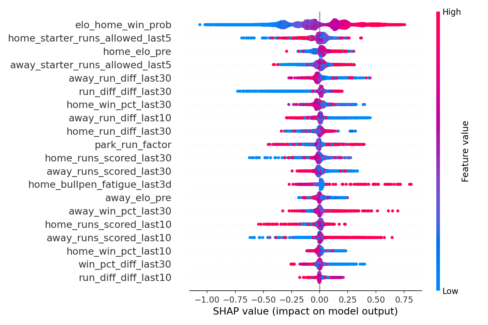
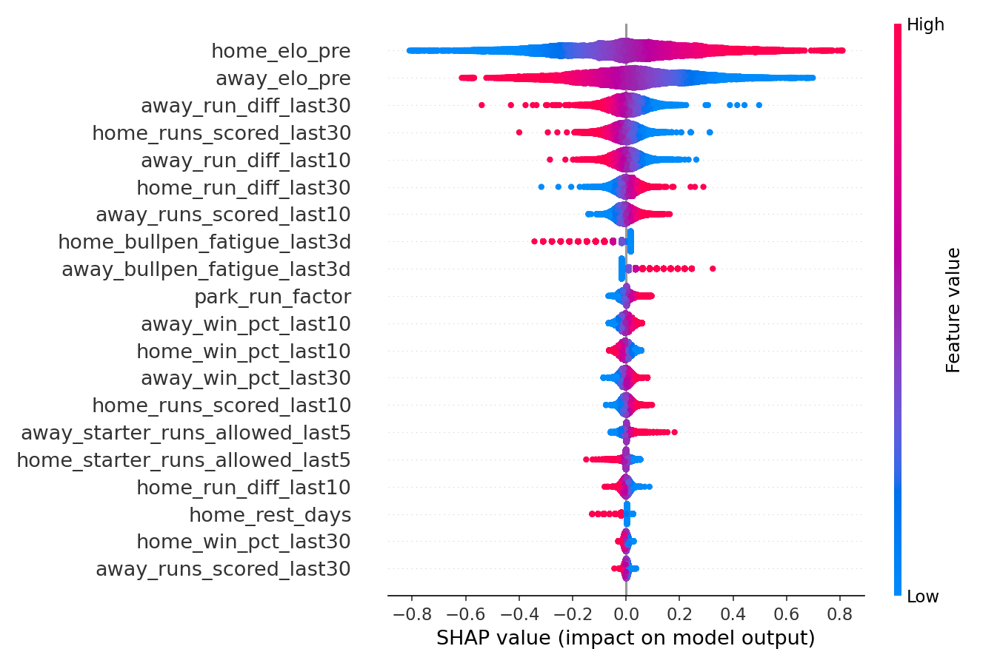

# MLB Game Outcome Predictor

**[Live demo →](https://mlb-game-predictor-sdt8.onrender.com)** (free-tier
hosting — the first request after ~15 min idle takes 30-60s to wake up)

Predicts the home team's win probability for a given MLB game, using only
information available before first pitch (no in-game or post-game leakage).

## Problem

Sports outcome prediction is judged on **calibration**, not raw accuracy — a
model that says "60% win probability" should be right about 60% of the time
across all such predictions. This project outputs a calibrated probability,
not just a binary pick.

Realistic ceiling: ~55-58% accuracy for MLB game prediction. Game-to-game
variance in baseball is high, and a model that claims much better than that
is almost certainly leaking information or overfitting. Explaining the
ceiling is part of the point, not a caveat to hide.

## Approach

1. **Data** — [`pybaseball`](https://github.com/jldbc/pybaseball): team/player
   stats (Baseball Reference, FanGraphs) and Statcast pitch-level data
   (Baseball Savant), 2015+.
2. **Leakage prevention** — chronological train/val/test splits (never random
   k-fold). All features are trailing/rolling windows computed strictly from
   games before the one being predicted. Enforced by
   [`tests/test_features.py`](tests/test_features.py), not just claimed in
   this README.
3. **Features** — rolling team form (win %, run differential, runs scored),
   rest days, bullpen fatigue (extra innings absorbed in the trailing 3
   days), park factors (trailing park scoring average vs. league average,
   estimated from this dataset itself), starting-pitcher identity (via
   Retrosheet, 2015-2023) plus a trailing runs-allowed-in-own-starts
   performance proxy, and an Elo rating system implemented from scratch.
   Starting-pitcher platoon splits (vs. opposing lineup handedness) are not
   implemented — see Limitations.
4. **Models**
   - Baseline: logistic regression.
   - Primary: gradient-boosted trees (XGBoost/LightGBM) — expected to win on
     this tabular data.
   - PyTorch: entity embeddings for team AND starting-pitcher identity
     (thousands of distinct pitchers vs. 30 teams — the highest-cardinality
     input in the project) concatenated with the same numeric features, +
     MLP head. Hand-written training loop (no Lightning), to demonstrate
     the mechanics.
5. **Evaluation** — walk-forward validation, log-loss + Brier score,
   calibration plots, and (where available) comparison against historical
   sportsbook closing-line implied probabilities as a near-efficient external
   baseline.
6. **Deployment** — FastAPI endpoint (team names + date -> win probability)
   with a three-tab web UI — **Predictions** (team/pitcher/hitter pickers and
   a matchup card with both teams' logos), **Players** (WAR and other stats
   as dot plots), and **Teams** (offensive rating and other team stats as
   logo dot plots) — containerized with Docker.

## Results

Walk-forward backtest on 2015–2024 (22,614 games; trained models tested on
2018–2024 after a 3-season burn-in, `min_train_seasons=3`; Elo evaluated on
every game since it updates online rather than needing a training split).
Reproduce with `python scripts/evaluate.py`.

| Model                        | Log-loss | Brier  | Accuracy | n      |
|-------------------------------|---------:|-------:|---------:|-------:|
| Elo (standalone)              |   0.6783 | 0.2427 |   56.97% | 22,614 |
| Logistic Regression           |   0.6759 | 0.2415 | **57.81%** | 15,372 |
| XGBoost                       |   0.6865 | 0.2464 |   56.41% | 15,372 |
| PyTorch (entity embeddings)   |   0.6797 | 0.2433 |   57.17% | 15,372 |

All four land inside the ~55–58% ceiling this problem should have — a useful
sanity check in itself, since a leaky pipeline tends to show up as
suspiciously good (65%+) accuracy.

Logistic regression still edges out the other two, but the gap closed
substantially once starting-pitcher features were added — and getting there
surfaced a real lesson worth walking through rather than just reporting the
final number:

**Before pitcher features** (team-level rolling form + Elo only): XGBoost
55.82%, PyTorch 56.15% — both clearly behind logistic regression's 57.86%,
because there wasn't much non-linear structure in team-level aggregates for
either model to exploit beyond what a regularized linear model already
captures from the same numbers.

**Adding pitcher identity (naively)**: XGBoost picked up the new
`starter_runs_allowed_last5` numeric proxy fine. PyTorch's accuracy
*dropped* to 55.05% — worse than before. Diagnosis: with ~480 distinct
starting pitchers averaging only ~30 starts each in a training fold, an
8-dimensional pitcher embedding table (same size as the team embedding,
which has 30 categories with thousands of games each) has far more capacity
than that data supports. Training loss kept falling smoothly to 0.61 over
30 epochs while held-out log-loss rose to 0.72 — the textbook shape of
memorizing individual pitchers' noise rather than learning a generalizable
representation.

**Fix**: cut `pitcher_embedding_dim` to 4 and `epochs` to 10 (swept
on one fold — see `config.yaml`'s `model.nn` comment for the numbers). That
alone took the same fold's held-out log-loss from 0.72 back to 0.68 — better
than the pre-pitcher-feature PyTorch model. Across the full walk-forward
backtest, PyTorch's accuracy went from 56.15% (no pitcher features) to
57.17% (pitcher features, regularized) and it now clearly beats XGBoost.

This is the same underlying lesson the project's stated ~55-58% ceiling is
about, one level down: more features and a fancier architecture aren't
automatically better — a high-cardinality embedding needs enough examples
per category to generalize, and it's easy to mistake a lower training loss
for a better model. Logistic regression still wins on this feature set,
which is a legitimate result — but PyTorch is now the closest challenger,
consistent with pitcher identity being the highest-cardinality input in the
project and the place embeddings had the most room to help.

## Limitations

- **Starting-pitcher performance is a proxy, not a real per-pitcher stat.**
  `starter_runs_allowed_last5` is the pitcher's *team's* runs allowed in
  each of their own prior starts — Retrosheet's basic game log doesn't
  break runs down by individual pitcher (that needs parsing the raw
  play-by-play event files, out of scope here), so this conflates some
  bullpen performance into "starter quality." No true ERA/FIP/WHIP, and no
  platoon splits vs. opposing lineup handedness (would need batter-handedness
  data per lineup, not just pitcher throwing hand).
  - Getting even this far took two separate upstream fixes, both documented
    in code: `pybaseball.retrosheet.season_game_logs()` validates via the
    GitHub API with an empty auth token (`AssertionError` on newer PyGithub)
    before ever reaching the actual data, and the retrosheet repo has since
    moved game logs from `gamelog/GL{season}.TXT` to
    `seasons/{season}/GL{season}.TXT`. See `src/data/fetch_pitchers.py`.
  - **No 2024 pitcher data** — Retrosheet's 2024 season directory has a
    schedule but no `GL2024.TXT` game log yet as of this build. 2024 games
    simply get an "unknown pitcher" embedding and NaN in the numeric proxy
    — the same missing-data handling as everywhere else in the pipeline,
    not a special case.
  - **No pitcher handedness** — FanGraphs (`pybaseball.pitching_stats`)
    returned 403 Forbidden in this environment; that was the intended
    source.
- **Elo hyperparameters (K-factor, home-field advantage, season regression)
  are set from published estimates, not tuned on this data.**
- **No sportsbook closing-line benchmark yet** — the market-calibration
  comparison described in the original plan needs a sourced historical
  odds dataset.
- **Rest-day / travel modeling is basic** — a simple day-count, no
  timezone-change or park-schedule-density signal.
- **The API recomputes on the full historical dataset (22k+ games) on every
  request** (~0.5s locally) — fine for a demo, but would need incremental/
  cached state (e.g. persisting each team's latest rolling-window state) to
  serve real traffic.
- **`requirements.txt` is pinned to exact versions**, not just because
  that's good practice — an earlier unpinned build genuinely broke: pip
  resolved a newer scikit-learn inside the container than the one that
  pickled `production_model.joblib`, and `SimpleImputer`'s internal
  attribute layout had changed between versions, so `predict_proba` raised
  `AttributeError` at request time (`InconsistentVersionWarning` at startup
  was the tell). Pin versions in the model-training environment too, not
  just the serving one — retrain and re-pin together if you bump a version.

## Repo Structure

See [`config.yaml`](config.yaml) for paths/hyperparameters and the `src/`
tree for pipeline stages: `data/` (`fetch.py` for schedules, `fetch_pitchers.py`
for starters, `fetch_statcast_leaderboard.py`, `fetch_rosters.py`,
`fetch_player_war.py`, and `fetch_team_stats.py` for live-API-only context —
none of these feed the model, `teams.py` for static team metadata (names,
logos, ballparks), `build_features.py` for the leakage-safe feature
engineering that does), `models/` (Elo,
baseline, GBM, PyTorch), `evaluation/` (metrics, walk-forward backtesting),
`api/` (FastAPI serving + `static/index.html`, the web UI).

## Setup

```bash
python3 -m venv .venv
source .venv/bin/activate
pip install -r requirements.txt
```

## Reproducing the pipeline

```bash
python -m src.data.fetch                      # pulls 2015-2024 schedules via pybaseball (slow, ~30 min first run)
python -m src.data.fetch_pitchers              # starting-pitcher identity via Retrosheet, 2015-2023 (~1 min)
python -m src.models.elo                       # Elo ratings -> data/processed/elo.csv
python -m src.data.build_features              # rolling features + park/bullpen/starter features -> features.csv
python scripts/evaluate.py                     # walk-forward comparison of all models -> the Results table above
python scripts/train.py                        # fits the production (logistic regression) model -> models/production_model.joblib
python -m src.data.fetch_statcast_leaderboard  # optional: current-season pitcher+batter context for the API (informational only)
python -m src.data.fetch_rosters               # optional: current team rosters, powers the web UI's dropdowns
python -m src.data.fetch_player_war            # optional: current-season Baseball-Reference WAR -> Players tab
python -m src.data.fetch_team_stats            # optional: current-season team stats (run after fetch_player_war) -> Teams tab
```

Note: importing `torch` before `xgboost` matters in the same process on
macOS (see the note in `src/models/gbm.py`) — `scripts/evaluate.py` already
gets this right.

## Running the API

```bash
uvicorn src.api.main:app --reload
```

Open `http://localhost:8000` for the web UI. It has three tabs (each
linkable: `#predict`, `#players`, `#teams`):

- **Predictions** — pick an away/home team, optionally a starting pitcher and
  up to 3 hitters per side (populated live from each team's current roster
  via `GET /roster/{team}`), and hit Predict. A short "Calibrating…" progress
  bar runs (held to a ~1.8s minimum so the result doesn't just flicker in),
  then the win probability lands on a matchup card — dark split design with
  each team's real logo fading in from its edge, adapted from a Figma Make
  template — followed by a side-by-side stat comparison.
- **Players** — every player's season line as a dot plot. *Leaderboard*
  ranks players on one stat (WAR by default; OPS+, xwOBA, hard-hit %, ERA+,
  whiff %, and more), each row tagged with the team logo. *Compare* plots any
  two stats against each other, and picking a team highlights its players
  against the league.
- **Teams** — each team's logo is its dot. *Rankings* sorts teams on one
  stat (offensive rating by default) against a league-average line;
  *Compare* plots two stats, e.g. offense vs. ERA as quadrants. Click a logo
  for that team's breakdown — record, stat tiles ranked 1–30, and its top
  hitters and pitchers by WAR.

Or hit the API directly:

```bash
curl -X POST localhost:8000/predict -H "Content-Type: application/json" \
  -d '{"home_team": "NYY", "away_team": "BOS"}'
# {"home_team":"NYY","away_team":"BOS","game_date":"...","home_win_probability":0.57, ...}
```

`game_date` is optional (defaults to today). `home_pitcher_id`/
`away_pitcher_id` are also optional (Retrosheet IDs, e.g. `"coleg001"` for
Gerrit Cole) — MLB announces probable starters only ~5 days out, so a
farther-out request has no way to know them and correctly falls back to the
same "unknown pitcher" handling used for any other missing-starter case.
Pass them once probables are announced for a same-day prediction that uses
the starter's own trailing performance. Note the *served* model (logistic
regression — see Results) only uses pitcher identity through the numeric
`starter_runs_allowed_last{N}` proxy, not the richer embedding the PyTorch
model gets; swap `MODEL_TYPE` in `scripts/train.py` to serve a different
model.

The endpoint recomputes rolling features for the requested game by
appending it to the cached historical game log and re-running the same
leakage-safe pipeline used for training — see `src/api/main.py` for why
that matters more than a hand-rolled "look up the latest stat" shortcut.

**Real Statcast context, informational only.** When a pitcher ID is
provided and matched, the response also includes that pitcher's real
current-season Statcast profile (ERA, xwOBA, whiff%, K%, BB%) — but this
is display-only and never reaches the model:

```bash
curl -X POST localhost:8000/predict -H "Content-Type: application/json" \
  -d '{"home_team": "NYY", "away_team": "BOS", "home_pitcher_id": "coleg001"}'
# {"home_team":"NYY", ..., "home_win_probability":0.579,
#  "home_pitcher_stats":{"era":3.22,"xwoba":0.282,"whiff_percent":22.2,"k_percent":26.6,"bb_percent":5.3},
#  "away_pitcher_stats":null}
```

Sourced from `python -m src.data.fetch_statcast_leaderboard` (Baseball
Savant's custom-leaderboard CSV export — not blocked, unlike `pybaseball`'s
FanGraphs scrape, and freely fetchable with a plain HTTP GET for any
season). It's kept out of the model deliberately: that endpoint only
returns full-season-to-date snapshots (no date-range filtering — tested
several parameter conventions, all silently ignored), so there's no
leakage-safe historical version of it to train on, and substituting it into
the model's existing `starter_runs_allowed_last{N}` slot would feed a
differently-distributed value (earned-only, per-9-innings,
season-cumulative) into a feature the model calibrated on a noisier one
(team total runs per start) — a substitution I chose not to make without
being able to validate it. See the module docstring for the full reasoning.
Refresh periodically to keep current-season numbers up to date — this file
isn't part of the leakage-safe training pipeline, so there's no walk-forward
discipline needed here, just freshness.

**Hitters, same informational treatment.** Up to 3 `home_hitter_ids`/
`away_hitter_ids` per side (also Retrosheet IDs) get AVG/SLG/OBP/RBI/Runs/
wOBA from `python -m src.data.fetch_statcast_leaderboard` (which now pulls
both pitcher and batter leaderboards). Batters were never a model input at
all — no batter data anywhere in training — so this is purely additive
display context, no substitution-risk reasoning needed.

**Players and Teams tabs, same informational treatment.** `GET /stats/players`
(filterable with `?role=hitter|pitcher` and `?team=NYY`) and `GET
/stats/teams` serve current-season lines, and `GET /teams/meta` serves each
team's name, division, ballpark, color, and logo URLs (MLB's own logo CDN,
keyed by MLB team ID — nothing vendored). Sources:

- **WAR / OPS+ / ERA+** — Baseball-Reference's public daily WAR files
  (`python -m src.data.fetch_player_war`). That's bWAR, not FanGraphs' fWAR:
  FanGraphs is behind a bot challenge here, same as the `pybaseball` scrape.
  Traded players' stints are summed per player and credited to the right
  team in the team totals.
- **Team totals** — MLB's official Stats API (`python -m
  src.data.fetch_team_stats`), joined with team WAR and OPS+ from the file
  above. The UI's **offensive rating is team OPS+** — PA-weighted average of
  the team's hitters' park-adjusted OPS+, 100 = league average — standing in
  for wRC+, which is also FanGraphs-only.
- Player contact-quality stats (xwOBA, hard-hit %, barrel %, whiff %) come
  from the Statcast leaderboards above, joined by MLBAM ID.

Like the Statcast context, these are season-to-date snapshots with no
point-in-time history, so none of it is a model input.

**Team/player dropdowns.** `GET /roster/{team}` (used by the web UI, and
directly queryable) lists each team's current active pitchers and hitters
by name, sourced from `python -m src.data.fetch_rosters` (MLB's official
Stats API — a third ID scheme, crosswalked to Retrosheet IDs the same way
as the Statcast leaderboards, via `chadwick_register()`).

### Docker

```bash
docker build -t mlb-predictor .
docker run -p 8000:8000 mlb-predictor
```

Verified end-to-end: built, ran, and hit both `/` (the web UI) and
`/predict` inside the container (with and without a `home_pitcher_id`, and
with and without the optional Statcast/roster files present at build time)
with results matching the non-Docker run exactly. Final image is 1.95GB.

The image bakes in `data/processed/game_log.csv`, `starters.csv`, and
`models/production_model.joblib` (required — the build fails without them)
plus `statcast_leaderboard.csv`, `statcast_batters.csv`, `rosters.csv`,
`player_war.csv`, and `team_stats.csv` if present (optional — the `COPY ... *`
glob pattern in the Dockerfile means the build still succeeds without them;
the API's pitcher/hitter_stats fields just stay null, and `/roster/{team}`
and `/stats/*` return empty lists). All eight are committed to git despite the general "processed data isn't versioned"
policy elsewhere in this repo — see the `.gitignore` comment for why: a
git-based build (Render, Docker Hub, anything that clones the repo rather
than reading your local disk) needs them to actually be in the repo, and
they're all under 2MB. Regenerate and recommit periodically if they go
stale (see "Reproducing the pipeline" above) — there's no live pull at
build/deploy time. The web UI itself (`src/api/static/index.html`) ships as
part of `COPY src/ src/` — no separate step needed.

The Dockerfile installs `torch` from PyTorch's CPU-only index before the
rest of `requirements.txt` — torch's default Linux wheel pulls in ~7GB of
NVIDIA CUDA packages that go completely unused (this container does CPU-only
inference), which was the difference between a 9.66GB image and this one.

### Live deployment (Render)

```bash
git push                                    # once this repo has a GitHub remote
```

Then, in Render's dashboard: New → Blueprint → connect the GitHub repo.
Render reads [`render.yaml`](render.yaml) and builds the existing
`Dockerfile` as-is — no separate configuration. The free plan spins down
after 15 minutes of no traffic and takes ~30-60s to cold-start back up on
the next request; fine for a portfolio demo, not for anything
latency-sensitive.

This step needs your own Render account and GitHub connection — both are
things only you can do (account creation and OAuth login aren't actions I
can take on your behalf). Everything up to "click connect" is prepared.

### CI

[`​.github/workflows/tests.yml`](.github/workflows/tests.yml) runs the full
`pytest` suite on every push once this repo has a GitHub remote. The API
tests skip gracefully (not fail) since GitHub's runner doesn't have the
data artifacts described above unless you also commit them — which, per
the previous section, this repo now does, so CI exercises the full suite
including `tests/test_api.py`, not just the leakage/Elo tests.

### Model explainability

```bash
python scripts/explain.py
```

Generates SHAP summary plots and feature-importance tables for both the
GBM and logistic regression models:

**GBM**


**Logistic regression**


Both pass an intuitive sanity check worth calling out: every feature's
SHAP direction matches baseball intuition (higher home Elo → higher home
win probability; higher home bullpen fatigue → lower home win probability;
etc.) — not guaranteed for a model that's just optimizing log-loss, so it's
a real signal the model learned something sensible rather than a spurious
correlation. `elo_home_win_prob`/`home_elo_pre` dominate both models' top
feature by a wide margin, consistent with Elo being the single most
information-dense input available.
